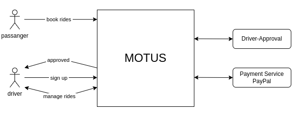
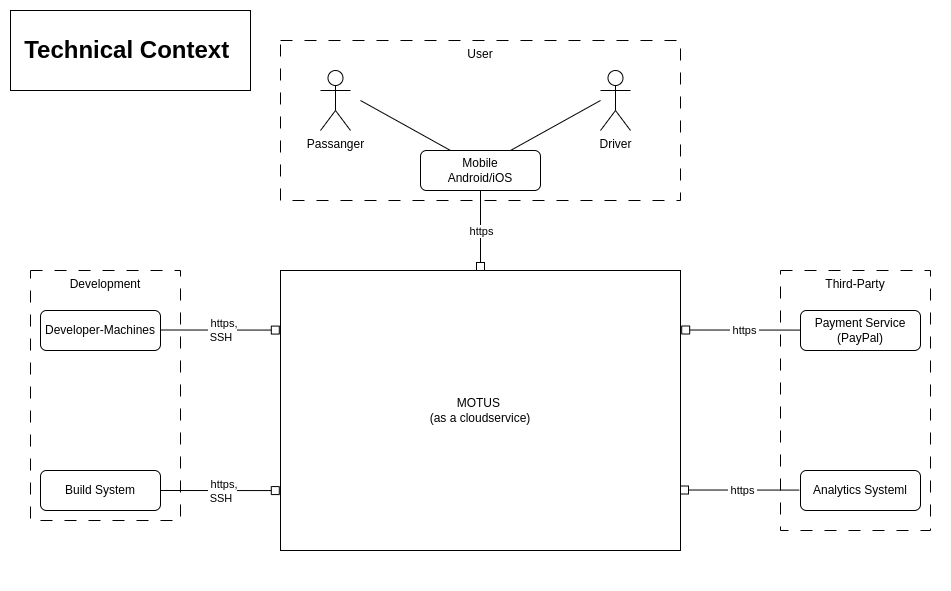

[<< Back](../README.md)

# Scope and Context

## Scope 

The app will be available for both iOS and Android devices.

The app will allow users to create profiles, search for rides, and connect with nearby drivers.

The app will include a payment system to facilitate transactions between drivers and passengers.

The app will use location-based services to identify nearby drivers and passengers.

The app will provide real-time updates on ride availability and estimated arrival times.

## Business Context 

List of stakeholders: 

- Passengers (want the ride)
- Drivers (provide the ride)
- Approval center (approve drivers)
- Payment service

### Representation

| Piece           | Purpose                                                                                                          |
|:----------------|:-----------------------------------------------------------------------------------------------------------------|
| MOTUS           | Our service to connect passengers and driver plus a payment service.                                             |
| Approval Center | Legal approval if drivers are allowed to drive. Receive a form and contact details of drivers via web-interface. |
| Payment Service | Handles payment of users and payout for drivers. Integrated over API with redirect to the payment provider.      |
| Passenger       | User can sign up to use our app.                                                                                 |
| Driver          | Provides driving service to passenger.                                                                           | 

## Technical Context

List of stakeholders: 
- App users
- Developer
- Approval center (approve drivers)
- Payment service
- Analytics service 

### Representation

| Piece     | Purpose                                                                                                         |
| :-------- |:----------------------------------------------------------------------------------------------------------------|
| MOTUS | Our service to connect passengers and driver plus a payment service.                                            |
| Approval Center | Legal approve if drivers are allowed to drive. Receive a form and contact details of drivers via web-interface. |
| Analytics service| A third party service to monitor the cloud and services running on it.                                          |
| Payment Service | Handles payment of users and payout for drivers. Integrated over API with redirect to the payment provider.     |
| App user| Connect to our services over the internet from Android/iOS devices.                                             |
| Developer | Human actor, responsible for App development, deployment and maintenance.                                       |