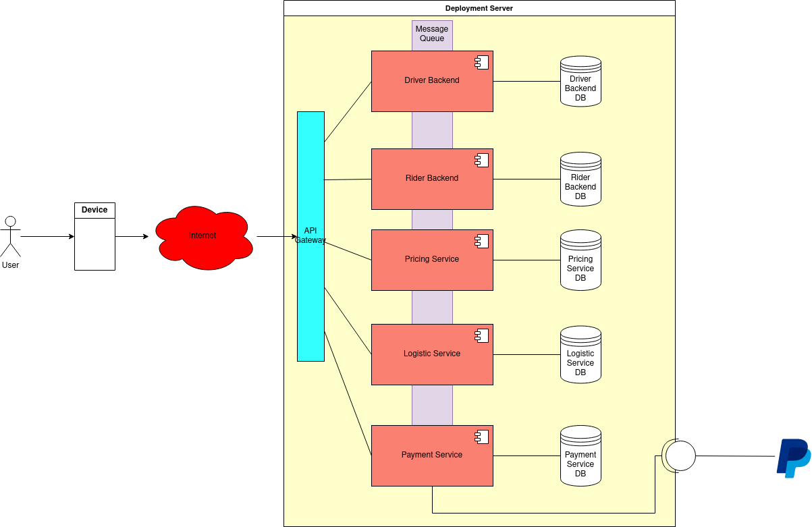

[<< Back](/README.md)

# Deployment View

---

<table cellspacing="0" cellpadding="6" rules="groups">
  <thead>
    <tr>
      <th scope="col">Node/Artifact</th>
      <th scope="col">Description</th>
    </tr>
  </thead>

  <tbody>
    <tr>
      <td>Load Balancer</td>
      <td>Multiplexes client requests to separate instances of the entire VPC.</td>
    </tr>
    <tr>
      <td>API Gateway</td>
      <td> Used for security, request aggregation, quality assurance, routing, etc.</td>
    </tr>
    <tr>
      <td>MOTUS Driver Backend</td>
      <td>REST server for the Driver-facing API</td>
    </tr>
    <tr>
      <td>MOTUS Passenger Backend</td>
      <td>REST server for the Passenger-facing API</td>
    </tr>
    <tr>
      <td>MOTUS Logistic Service</td>
      <td>Responsible for calculating routes and available drivers.</td>
    </tr>
    <tr>
      <td>MOTUS Pricing Service</td>
      <td>Responsible for calculating trip fare.</td>
    </tr>
    <tr>
      <td>MOTUS Payment Interface</td>
      <td>Backend microservice for communicating with the external payment service.</td>
    </tr>
    <tr>
      <td>MOTUS Message Queue</td>
      <td>Inter-Service Communication, i.e. RabbitMQ</td>
    </tr>
    <tr>
      <td>MOTUS Logging Interface</td>
      <td>Provides a centralized interface for logging, i.e. ElasticSearch/DataDog etc. </td>
    </tr>
  </tbody>
</table>
